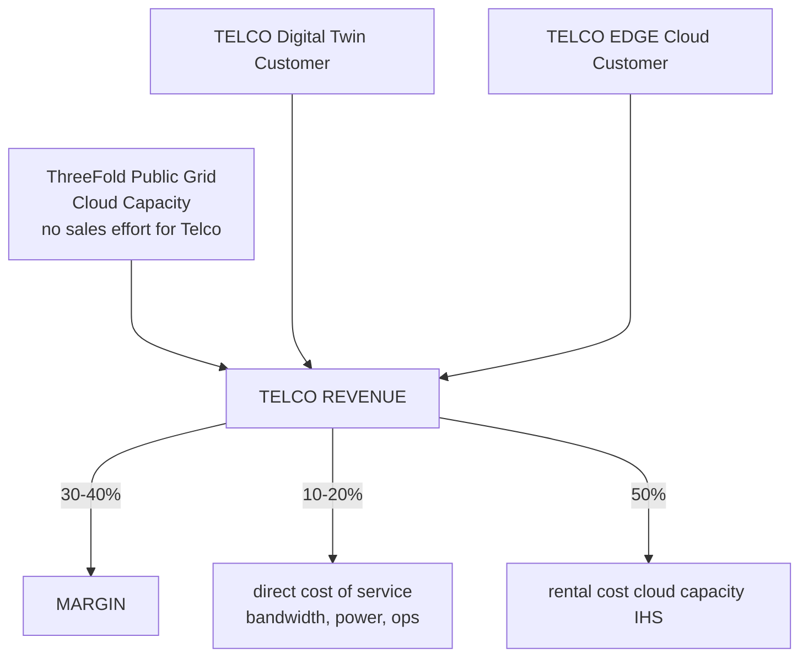
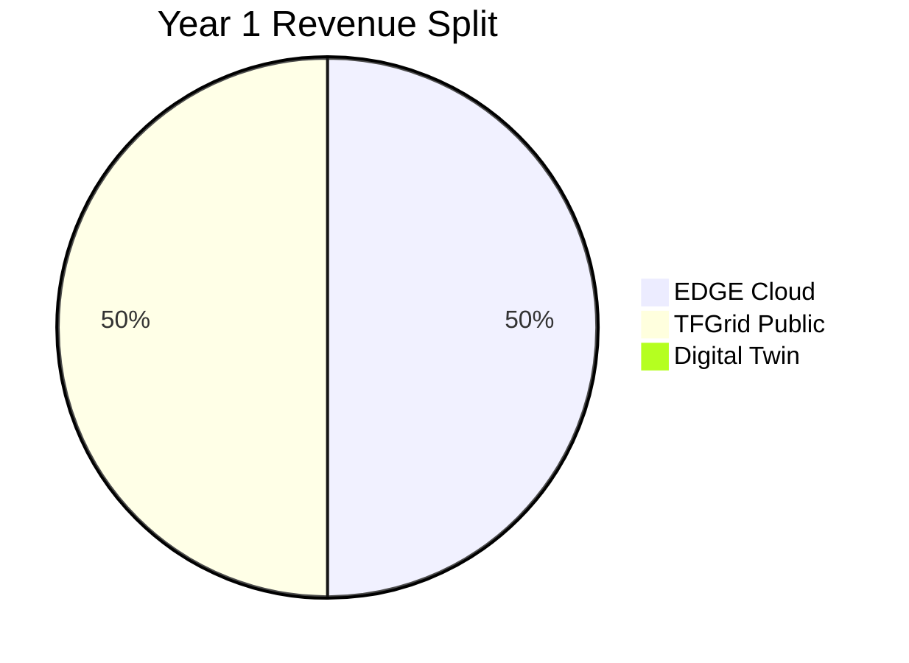
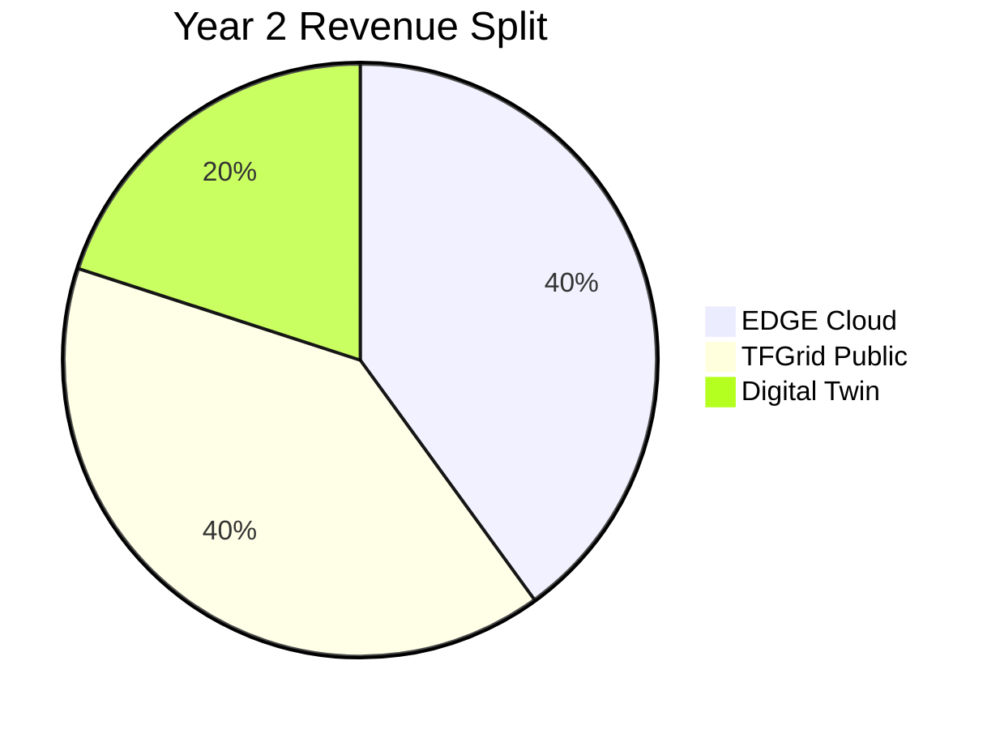
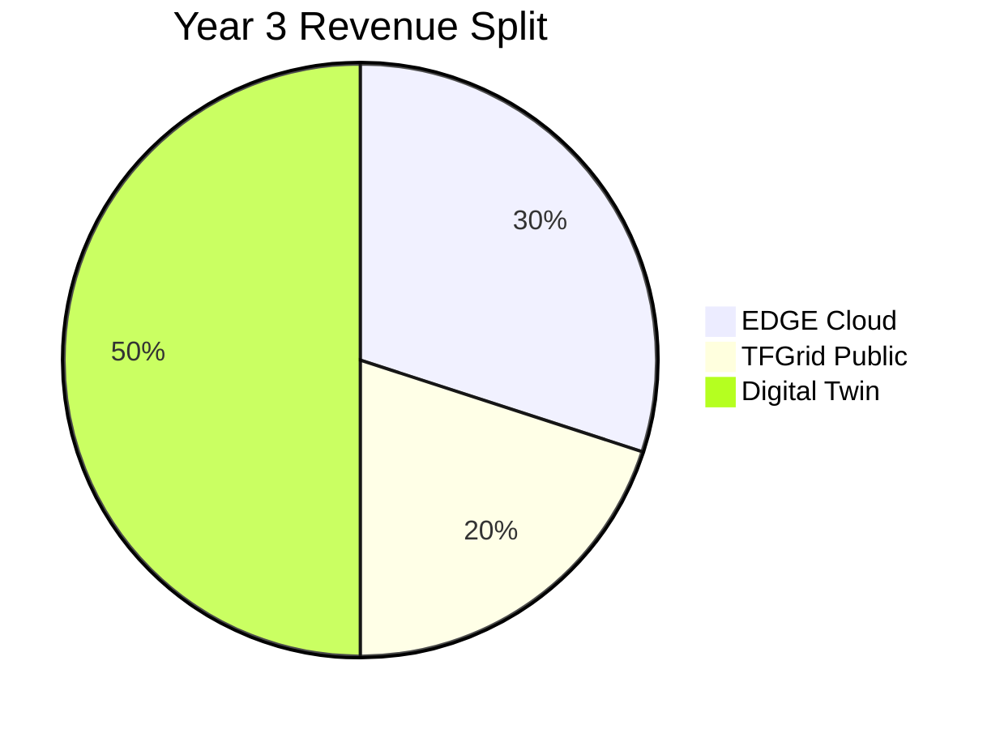

# Telco Biz Model

## revenue streams

Possible estimates of how business shifts over years

|  | Edge Cloud  | Digital Twin  | Public Grid  |
|---|---|---|---|
| description | storage,compute, network capacity  |   |  |