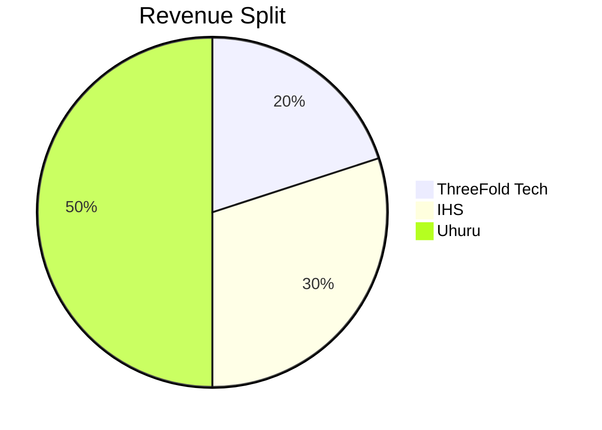

# IHS - UHURU - THREEFOLD PARTNERSHIP (A FIRST ATTEMPT)

Ofcourse there are other possibilities e.g. IHS takes care of capex part with financial partners.

## Revenue Split

Revenue as what comes back from Telco partner.

- IHS can bill seperately for
  - setup services (installation)
  - products created on top of the capacity
  - maintenance, monitoring, operational services to e.g. telco's

## Responsibility Matrix

| IHS  | UHURU  | TFTech  |
|---|---|---|
| Contact to Telco  | Cloud Equipment - servers - compute -  network  = Capex|  Technology Creation |
| Sales  | Customizations for IHS business model | Upgrades & Maintenance  |
|  L2 Support  |  L3 Support   | L4 Support  |
| Installation |  marketplace of partner solutions |   |
| Operations (*)  | custom engineering for better HW solutions  |   |
| TBD...  | carbon biz model add on (carbon neutral approach)  |   |

- (*) is additional business

## Remarks

- Uhuru does the investments in hardware.