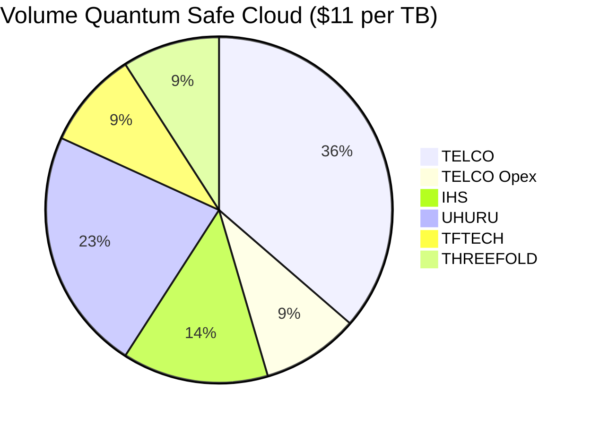

# Storage Product

Through Telco and enterprise contacts.

- Enduser price 10-50 $ / TB per month

## for bulk (volume) storage

| party  | if 1000 PB sold at 11$|
|---|---|
| TELCO  |  $4m/month |
| TELCO OPEX  | $1m/month  |
| IHS  |  $1.5m/month |
| UHURU |  $2.5m/month |
| TFTech  |  $1m/month |
| Foundation |  $1m/month |

Do note the 10% on public site of TFGrid towards Foundation is used for

- reward staking pools
- burning of tokens (lower amount of TFT in field)
- promotion of the grid (sales & marketing of utilization of grid)

### Remarks

- Capex investment cost for 1000 PB = $50m 
- Revenue potential $5 to $50m per month, either way an incredible business case
 
 1.25m 