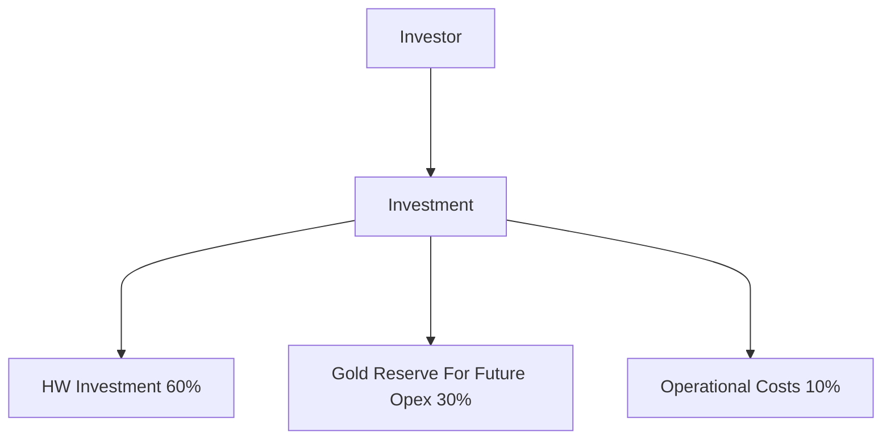
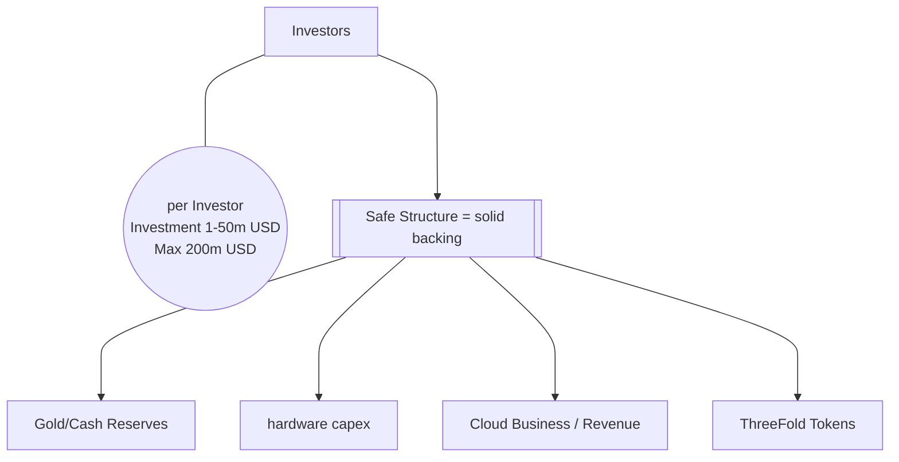

# Investment Structure

- legally the investment is
  - pre-purchase (warrants) of shares
  - Compatible with sharia banking principles.
- max round size 200m USD (12 months open)
- min ticket size = 100k USD, max ticket size 50m USD
- 10% for Uhuru Team
- 10% for ThreeFold Tech
- 20% of profits -> warrants to Uhuru Team

## Examples

- 50m USD investor -> will have 25% of 80% = 20% of company.