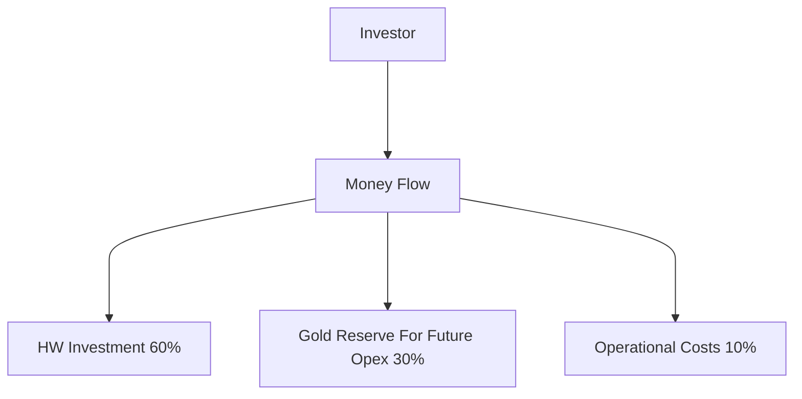
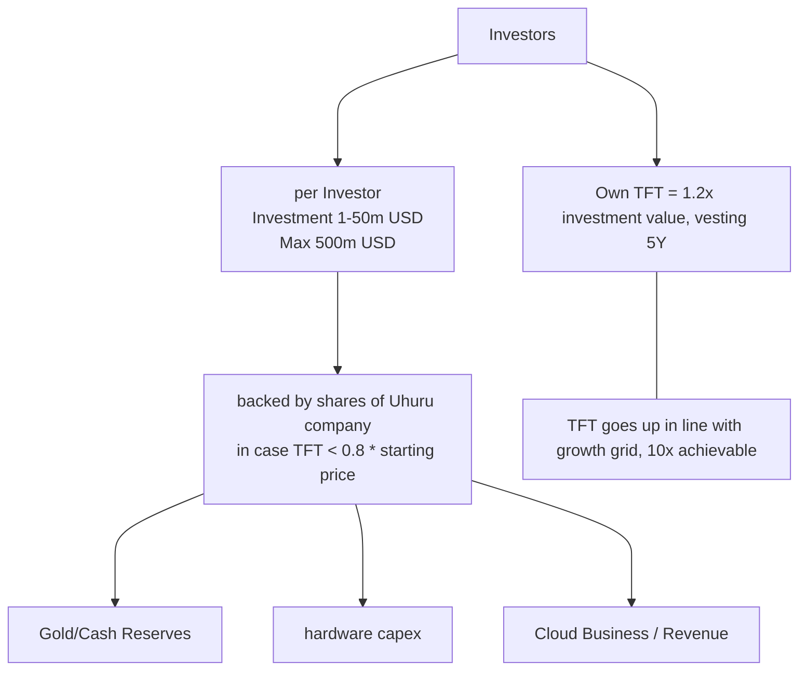

# Investment

- Investor owns TFT (vesting over 5 years, first year standstill)
- And gets warrants on shares of company in case TFT goes below certain value.
- Compatible with sharia banking principles.

- legally the investment is
  - pre-purchase of cloud capacity
  - warrants on shares in case TFT goes below certain price
  - cloud capacity can be bought/sold by means of token called TFT
- what if investor cannot invest in such a structure
  - special purpose investment vehicle (SPIV) is created which allows 1 or more investors to invest in a tax optimized structure which will hold the TFT and warrants.
  - the SPIV will get exit after 5 years, by or selling the structure, IPO or capital decrease